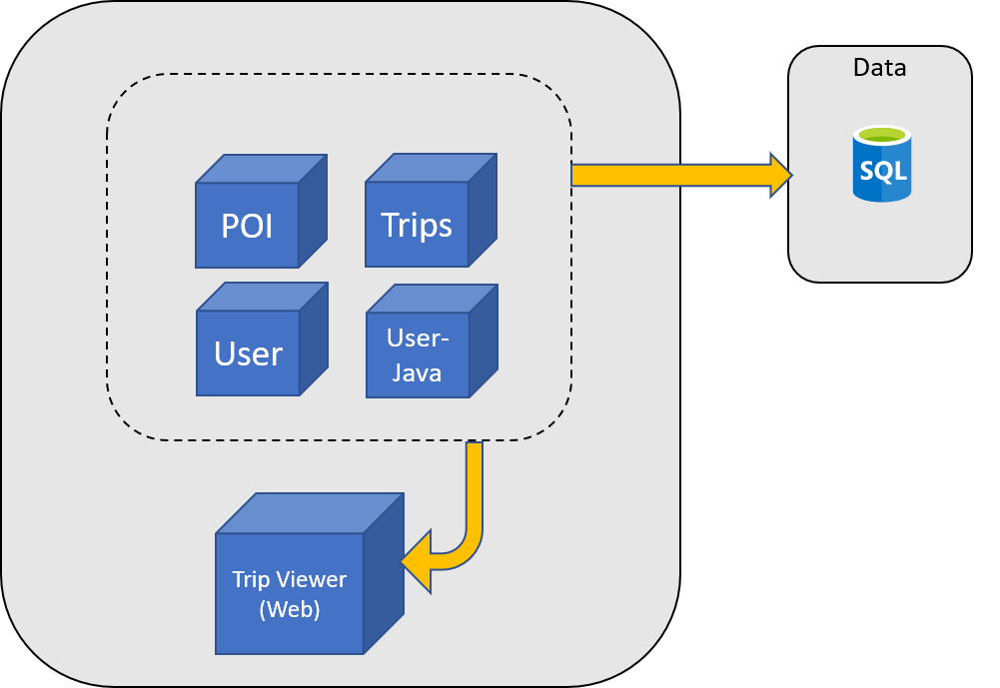

# OpenHack

Hello and welcome to OpenHack, a challenge oriented hack event from Microsoft. You will be presented with a series of challenges, each one more difficult than the one before.

You should already be assigned to and seated with a team, with whom you will attempt to solve as many challenges as you can within today's hack time.

You have been assigned a coach who will be your first point of contact, and is here to support you and answer questions during the hack. They will not, however, solve the challenges for you.

You may notice a resource group called **teamResources** in your Azure subscription. This resource group contains any pre-provisioned resources referenced in the challenges.

## The Premise

You work for Humongous Insurance. One of their products provides customers the opportunity to qualify for lower car insurance rates. Customers can do this by opting in to use Humongous Insurance's TripInsights app, which collects data about their driving habits. Your team has been assigned to modernize the application and move it to the cloud.

The TripInsights application, once a monolith, has been refactored into a number of microservices:

- **Trip Viewer WebApp (`.NET Core`)**: Your customers use this web application to review their driving scores and trips. The trips are being simulated against the APIs within the OpenHack environment.
- **Trip API (`Go`)**: The mobile application sends the vehicle's on-board diagnostics (OBD) trip data to this API to be stored.
- **Points of Interest API (`.NET Core`)**: This API is used to collect the points of the trip when a hard stop or hard acceleration was detected.
- **User Profile API (`NodeJS`)**: This API is used by the application to read the user's profile information.
- **User API (`Java`)**: This API is used by the application to create and modify the users.

The source code of all the microservices is available [here](https://github.com/Microsoft-OpenHack/containers_artifacts).

## The Challenges

Each challenge will lead you through a stage of the technical investigation as briefly laid out by your fictional CTO. These investigations become more technically challenging as you progress.

We do not provide guides or instructions to solve the challenges, just a few hints and documentation references that you may find useful. There are multiple ways to solve each challenge, and very likely some we haven't thought of. We're interested in seeing your own unique solutions to each problem, and you should absolutely work with your coaches and the OpenHack Team to validate your solution as correct.

### One final tip: **Read everything very carefully**

The OpenHack team have worked hard to ensure each problem is solvable. All the details you should need are within the challenge briefs, which are very carefully written and worded to give you clues toward the solution. Reading them fully is the best way to figure out a solution, as small points can be easily missed. Your coaches will help to fill gaps in your understanding, provided you ask them the right questions.
